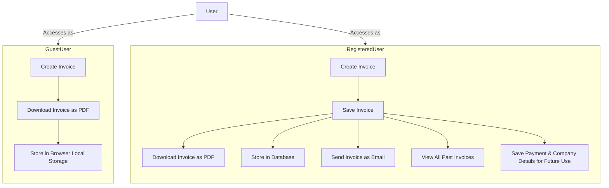

# BillForge

**BillForge** is a lightweight, customizable invoicing tool created for freelancers and small businesses. This self-hosted web application enables users to quickly generate, download, and manage invoices. It supports both guest access and registered user accounts, offering flexibility for various user needs. Built on the **MERN stack** (MongoDB, Express.js, React, and Node.js), BillForge delivers a fast and responsive experience, complete with PDF downloads and email invoicing options.

## Key Features

1. Create and manage invoices seamlessly
2. Download invoices as PDFs
3. Send invoices via email directly to clients

## System Overview

### User Access Types

**BillForge** offers two types of user access:

1. **Guest User**
2. **Registered User**

#### Guest User

- Generate invoices without needing to sign up.
- Download invoices as PDFs.
- Temporarily store invoice data in browser local storage.

#### Registered User

- Create and securely save invoices for future access.
- Download invoices as PDFs or send directly via email.
- Save payment and company details to streamline future invoicing.
- Access all past invoices through a personal dashboard.
- Customize invoices by uploading a logo.

## Invoice Types

The app currently supports two invoicing models:

1. **Time-based invoice**: For billing clients by hourly work.
2. **Product-based invoice**: For billing clients by products/services provided.

### Time-based Invoices

Ideal for users billing by time, allowing the addition of time entries with automatic total calculation based on an hourly rate.

### Product-based Invoices

Designed for itemized billing, enabling users to add multiple products/services, with automatic total calculation based on individual prices and quantities.

## Tech Stack

1. **MongoDB** - Database for storing user and invoice data
2. **Express.js** - Backend framework for handling server logic
3. **React** - Frontend library for building user interfaces
4. **Node.js** - JavaScript runtime for backend development

## Documentation

For more information on setup, deployment, and additional features, please refer to the [wiki](https://github.com/keizerworks/invoicen/wiki).

## Contributing

We welcome contributions! Please review our [contribution guidelines](CONTRIBUTING.md) to learn more. Whether you’re interested in fixing bugs, adding features, or improving documentation, your contributions are highly valued.

---

Let me know if there’s anything more you’d like to adjust!
